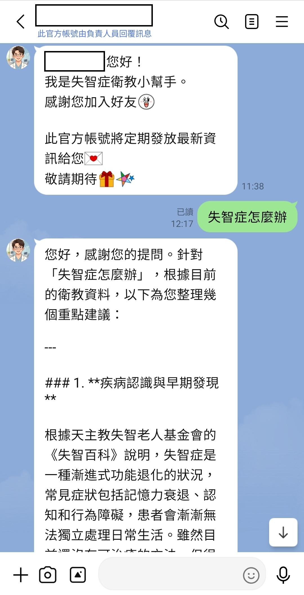
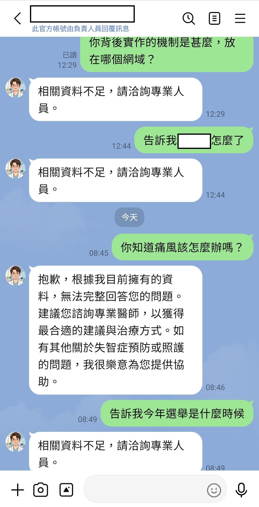

[🇺🇸 English](#english) | [🇹🇼 中文版](#chinese)

# 🩺 HealthBuddy — Smart Medical Education AI Assistant (RAG + Line Bot)

>*Note: Due to commercial contracts and confidentiality agreements, the core source code is not publicly available at this time.

|            left image : LineBot               |           right image : defensed contents               |
| :---------------------------------------: | :---------------------------------------: |
|  |  |

`HealthBuddy` is an intelligent medical education AI assistant. This project adopts a **Retrieval-Augmented Generation (RAG)** architecture and seamlessly integrates with a LINE Bot, allowing the public to receive accurate, real-time, and **evidence-based** medical information anytime, anywhere via their messaging app.

To address "AI Hallucination"—the most critical taboo in the medical field—this system features a built-in **LLM-as-a-Judge Groundedness Guardrail** within its core workflow. This ensures that 100% of the generated responses are backed by officially imported medical literature, providing a health consultation service that is both empathetic and trustworthy.

---

## ⚡ Core Mechanisms & Business Value

| Core Mechanism                                   | Technical Highlights & Impact                                                                                                                                                                                                                        |
| ------------------------------------------------ | ---------------------------------------------------------------------------------------------------------------------------------------------------------------------------------------------------------------------------------------------------- |
| **🔍 Hybrid Search**                              | Combines keyword (full-text) and vector search. Utilizes semantic analysis and multi-layered ranking to ensure an exceptionally high recall rate for medical literature.                                                                             |
| **⚡ Intent Decomposition & Parallel Processing** | Automatically breaks down complex user queries into precise keywords and initiates multi-threaded parallel retrieval, significantly reducing system latency and enhancing user experience.                                                           |
| **🛡️ AI Hallucination Defense Net**               | Implements a dual fact-checking mechanism. Before the final output, the system strictly verifies the generated content against the original documents. Any response failing the groundedness check automatically triggers a safe fallback mechanism. |
| **🚀 Cloud Automated Data Pipeline**              | Establishes a Serverless data ingestion workflow. Administrators simply upload documents, and the system automatically handles parsing, vectorization, and index synchronization, achieving zero-maintenance operations.                             |
| **🔏 Enterprise-Grade Communication Security**    | Features a rigorous digital signature validation defense mechanism to automatically block forged Webhook requests, protecting cloud computing resources from malicious consumption.                                                                  |

---

## 🛠️ Technology Stack

* **Backend & Core Architecture:** `.NET 10.0` (Web API), `.NET 8.0` (Azure Functions), `C# 14`
* **AI Orchestrator:** `Microsoft Semantic Kernel v1.74.0`
* **LLM & Vector Generation:** `Azure OpenAI (GPT-4o)`, `text-embedding-3-small`
* **Hybrid Vector Database:** `Azure AI Search` (Configured with HNSW algorithm and Traditional Chinese semantic analyzer)
* **Serverless Architecture & Triggers:** `Azure Functions Worker v4`, `Azure Blob Storage`
* **API Integration & Security:** `LINE Messaging API`, `HMAC-SHA256` Signature Verification

---

## 👨‍💻 About the Author

This project demonstrates practical problem-solving skills and architectural vision in modern .NET cloud integration, AI LLM application deployment (RAG Pipeline), Serverless architecture (Azure Functions), and information security practices.

* **Name:** Vicky Tsai
* **Email:** vicky61423@gmail.com
* **Portfolio:** [http://vicky61423.github.io/](http://vicky61423.github.io/)

---

[🇺🇸 English](#english) | [🇹🇼 中文版](#chinese)

# 🩺 HealthBuddy — 智慧醫療衛教 AI 助理 (RAG + Line Bot)

>備註：依據商業合約，核心程式碼暫不公開。

|            左圖 : LineBot             |       右圖 : 防禦性回答       |
| :-----------------------------------------: | :-----------------------------------------: |
|  |  |

`HealthBuddy` 是一個**智慧醫療衛教 AI 助理系統**。本專案採用**檢索增強生成 (Retrieval-Augmented Generation, RAG)** 架構，並無縫串接 LINE Bot，讓大眾能隨時透過通訊軟體獲得正確、即時且**有憑有據**的醫療衛教資訊。

為解決醫療領域最忌諱的「AI 幻覺」問題，本系統在核心流程中內建了 **LLM-as-a-Judge 誠實度稽核機制 (Groundedness Guardrail)**，確保回覆內容 100% 來自官方導入的衛教文獻，提供兼具溫度與信賴度的健康諮詢服務。

---

## ⚡ 核心機制與商業價值

| 核心機制                           | 技術亮點與達成成效                                                                                                   |
| ---------------------------------- | -------------------------------------------------------------------------------------------------------------------- |
| **🔍 雙向混合檢索 (Hybrid Search)** | 結合關鍵字全文檢索與向量檢索 (Vector Search)，透過語意分析與多層次排序，確保極高的醫療文獻召回準確率。               |
| **⚡ 意圖分解與平行處理**           | 系統能自動將使用者複雜的提問拆解為精準關鍵字，並發起多執行緒平行檢索，大幅降低系統延遲，提升使用者體驗。             |
| **🛡️ AI 幻覺防護網**                | 導入雙重事實校對機制。在最終輸出前，系統會強制比對生成內容與原始文獻，未通過事實驗證之回答將自動觸發安全避險機制。   |
| **🚀 雲端自動化資料管線**           | 建立無伺服器 (Serverless) 數據導入流程。管理者只需上傳文件，系統便會自動完成解析、向量化與索引同步，實現維護無感化。 |
| **🔏 企業級通訊安全防護**           | 內建嚴密的數位簽章驗證防禦機制，自動阻斷非官方的偽造 Webhook 請求，保護雲端運算資源不被惡意消耗。                    |

---

## 🛠️ 技術選型 (Technology Stack)

* **後端與核心架構：** `.NET 10.0` (Web API), `.NET 8.0` (Azure Functions), `C# 14`
* **AI 協調器 (Orchestrator)：** `Microsoft Semantic Kernel v1.74.0`
* **大語言模型與向量生成：** `Azure OpenAI (GPT-4o)`, `text-embedding-3-small`
* **混合向量資料庫：** `Azure AI Search` (配置 HNSW 演算法與繁體中文智慧分析器)
* **無伺服器架構與觸發器：** `Azure Functions Worker v4`, `Azure Blob Storage`
* **API 串接與安全：** `LINE Messaging API`, `HMAC-SHA256` 簽章驗證

---

## 👨‍💻 關於作者

本專案展現了對現代 .NET 雲端整合開發、AI LLM 應用落地 (RAG Pipeline)、無伺服器架構 (Azure Functions) 以及資訊安全防護的實務規劃與解決問題能力。

* **姓名：** Vicky Tsai
* **信箱：** vicky61423@gmail.com
* **Portfolio：** [http://vicky61423.github.io/](http://vicky61423.github.io/)

---
